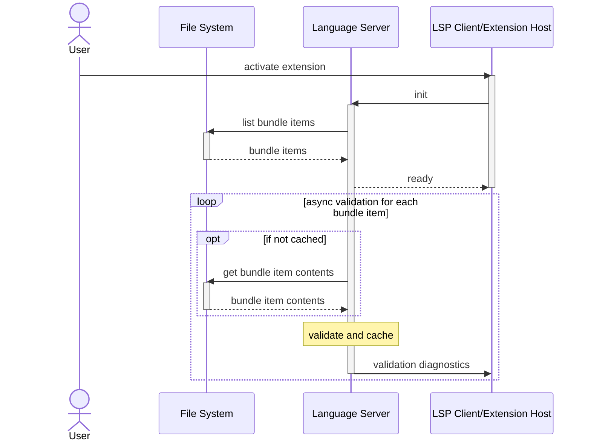
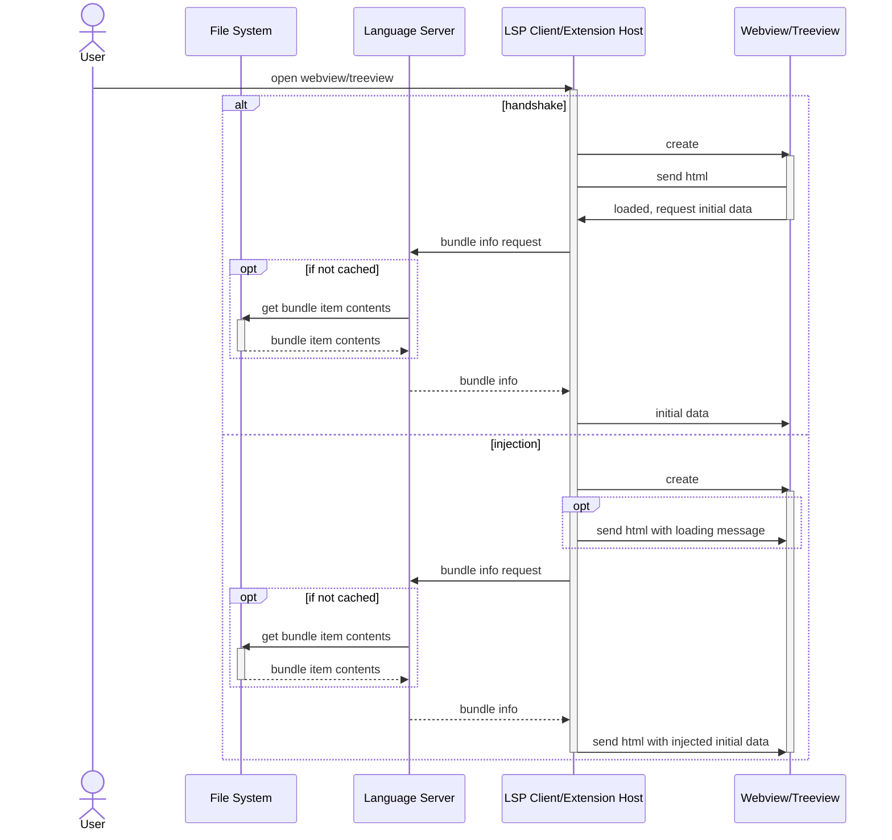
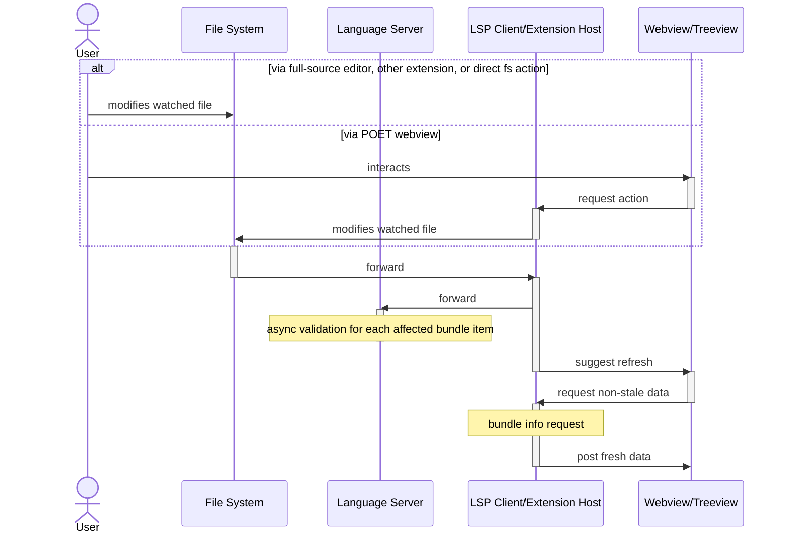

# VSCode Extension to edit textbooks [in gitpod](https://gitpod.io/from-referrer/)
[](https://codecov.io/gh/openstax/poet)
[](https://gitpod.io/from-referrer/)


Table of Contents
=================

* [Development](#development)
   * [Setup](#setup)
   * [Tests](#tests)
      * [Why 3 test frameworks?](#why-3-test-frameworks)
   * [Quick Startup](#quick-startup)
   * [Debugging](#debugging)
      * [Debugging JavaScript in Webviews](#debugging-javascript-in-webviews)
      * [Debugging Unit Tests](#debugging-unit-tests)
* [Publishing](#publishing)
   * [Local .vsix](#local-vsix)
* [Design](#design)
   * [Extension Activation](#extension-activation)
   * [Opening a Webview](#opening-a-webview)
   * [Editing Files and Interaction](#editing-files-and-interaction)
* [Generating XSD schema files](#generating-xsd-schema-files)


# Development

## Setup

```sh
npm install
npm run build
```

## Tests

Run all/some of the tests:

```sh
npm run test
# Or: npm run test:unit
# Or: npm run test:client
# Or: npm run test:cypress
# Or: npm run test:unit:watch
```

### Why 3 test frameworks?

1. `npm run test:unit`: Try to use this first. Jest is fast, works with VSCode's debugger so you can set breakpoints in tests or code, and only reruns tests that are affected by your uncommitted files.
1. `npm run test:client`: Use this when you cannot mock VSCode. It is really slow and hard to debug because it starts up a real VSCode instance and the TypeScript must be pre-built into JavaScript.
1. `npm run test:cypress`: Use this when you test webviews. It is really slow because it starts up a real browser.


## Quick Startup

1. Run `npm run build`
1. Launch the `[Run Extension]` task in the VSCode _Run and Debug_ panel
1. Open a CNXML file (in [./modules/](./modules) for example)
1. Click the Preview button on the top-right of the editor
1. Launch the `[Attach to Language Server]` from the _Run and Debug_ panel


## Debugging

### Debugging JavaScript in Webviews

Open the Webview Developer Tools by opening the command pallete and selecting `Developer: Open Webview Developer Tools`. This will allow you to inspect the webview contents. **Note:** It can only be opened when the webview is open.

### Debugging Unit Tests

The unit tests can be debugged using the VSCode debugger. There are 2 ways to run the tests:

1. If you run the Unit tests from the `[Run and Debug]` VSCode panel then breakpoints will work.
1. If you want to run the tests from a terminal, follow the instructions to set the [Auto-Attach setting in VSCode](https://code.visualstudio.com/docs/nodejs/nodejs-debugging#_auto-attach) and then run `npm run test:unit` or `npm run test:unit:watch`.

# Publishing

We rely on [this Concourse pipeline](https://github.com/openstax/concourse-pipelines/tree/master/release-poet) to publish a new version to the [VSCode Marketplace](https://marketplace.visualstudio.com/items?itemName=openstax.editor) and [OpenVSX.org marketplace](https://open-vsx.org/extension/openstax/editor) whenever a new tag is created on this repo.

The Major version will _eventually_ track the repo schema verion that is supported so try to bump minor/patch versions.


## Local .vsix

Update the version in `package.json` if desired (e.g. to associate with an issue, `0.0.0-dev-cnx1234`). Then:

```sh
npm run build:production
npm run package
```

# Design

## Extension Activation



## Opening a Webview



## Editing Files and Interaction



# Generating XSD schema files

The CNXML schema validation in the extension is performed using XSD files generated using the RelaxNG schema files in the `poet-schema` branch of the [cnxml repo](https://github.com/openstax/cnxml). The XSD files can be regenerated using [jing-trang](https://github.com/relaxng/jing-trang.git). You can clone that repo and follow the instructions to build `trang.jar` and `jing.jar`. The following steps assume:

* You have the `jing-trang` repo cloned as a peer of this repo and successfully built the JAR files there (you can otherwise simply modify the paths as necessary for your environment)
* You have the `cnmxl` repo cloned as a peer of this repo

```bash
$ git -C ../cnxml checkout poet-schema
$ java -jar ../jing-trang/build/jing.jar -s ../cnxml/cnxml/xml/poet/schema/rng/poet-jing.rng > poet-simplified.rng
$ java -jar ../jing-trang/build/trang.jar -I rng -O xsd poet-simplified.rng client/static/xsd/mathml.xsd
$ patch -p1 < client/static/xsd/trang.patch
$ rm poet-simplified.rng
```
