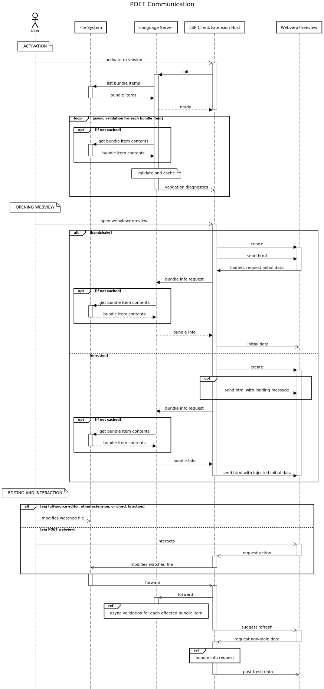

# VSCode Extension to edit textbooks [in gitpod](https://gitpod.io/from-referrer/)
[](https://codecov.io/gh/openstax/poet)
[](https://gitpod.io/from-referrer/)


## Dev instructions
1. open this directory in VSCode.
1. Run `npm install`
1. Run `npm run watch:webpack` (this will continue running / recompiling as you make changes)
1. Launch the "Run Extension" task
1. Open an XML file
1. Click the Show Preview button on the top-right of the editor
    - If you do not see it that is because it is invisible because we have not created an icon. Open a Markdown file, take note of where the icon is, and then click in the same area when viewing the CNXML file

For debugging, open the webview developer tools by opening the command pallete and selecting `Developer: Open Webview Developer Tools`. This will allow you to inspect the webview contents. **Note:** It can only be opened when the webview is open.

The tests for client and server require running the `npm run build` script beforehand. For example, the server tests can be run via command line as follows:

```bash
$ npm install
$ npm run build
$ npm run test:server
$ npm run test:client
```

If you use the launch configuration to invoke the client tests from VS Code, the `build` will be run automatically.

## Enabling the Code editor for Gitpod

Go to your [settings](https://gitpod.io/settings/) view and select "Enable Feature Preview". Then, you can choose Code as your Default IDE (or switch back to Theia). The change will be reflected in any new workspace you create.

## How to create the .vsix extension for Theia or gitpod

1. Update the version in `package.json` if desired (e.g. to associate with an issue, `0.0.0-dev-cnx1234`)
1. `npm run build:production`

## How to upload the .vsix extension to gitpod (Code editor)

If you are using the Code editor, the manual package update steps are:

1. Upload the `.vsix` file to your workspace
1. Right click on the uploaded file, and select "Install Extension VSIX"
1. If prompted to do so, reload the browser
1. Delete the package file from your workspace

## Activating the extension

Currently our extension will activate when it detects an XML file. If it doesn't exist already, you can populate the following in your `settings.json` to associate `.cnxml` files as XML:

```json
{
    "files.associations": {
        "*.cnxml": "xml"
    }
}
```

In a Theia editor, this file should be `.theia/settings.json` in your workspace, and for VS code it should be `.vscode/settings.json`. Once set, you can open any CNXML file and the extension should load.

## Diagram of POET server/client/webview communication


[Link to Diagram](https://sequencediagram.org/index.html#initialData=C4S2BsFMAIAUHkCiAVaBhA9gWywVwHYgDGAhqBvgFCUlHAYBO0AqgM6QOUAOJDoRIHvmDQARADEQUaAGUAnq2CQso6CVbRxM7r36CSwsQBkDAc1wlTMGRwBuHVetl2OOvsX2HRRmbHTgQSGEAekQADyV8VhAKaAAJDEVHDQTFNz0hEVEAdUgAI1tAgHdg5AZISELIIuT0ClZcLFdKfAwlaAx7JjYOAC5oAEE0ZABJADUB0fgAOUoehgBaAD4l1OB+2lBbMhhICKDoiho6EG32tco15ZsGLt6QQmBjrZ3nW9cbruWtfoDFaDyBAAJtIwMpWM9Tq8tJQtAtri4GP1AfgQTAwVgIUDIJsoe0YZ8OPDVol1tByiQgXJKNjcWcYBdKOAMBguGpWHJ8ERoNsAkCyDF8NAAGaMaA4ogACwBwNBSiwlFZIhAwugrREpClkCBlEJiyWP2gVhEKLR0Ax0CIFEiwAhdOh2jhCPeSJlqLlykt1qCtppEpe+O0QR16pgnQ4bzuPJIfNeBiBltoksgusRyxJin6vJA-PIQqBIEsrUUxCx-rx1kRlGD1FDHS6LHYrvgsEQ0xG0wA4tBsogAEJjEaIbJzJvptb9VlBaBFfJVErAcqVYqQ+nxUk0cAiSXx1g7gDWKauS0wUUafUtFKUq9ep4aTU4x7v59d7FR0ElwCw4Eoz4fywnaBmUpbUABpyUgABHXBIH+B4wELcBoFzEg-Xtdo-1cY89WRWV0XwUUIOg2CniVc1VXVRMtR1PVvhkfpjTdM0LStYQfTtE41xhJ0lhwpiPSwL02OEMt0JgGEa1ogDSVw918NFS5SXTTDXXg0AY2QshUMgcB2HNfAACtIBOI4n3qF9+iIK8UzEuozwfRUuCeMz7IvN8E0-b8ZzAaVgILfBTGgJpWFYSwUxrbDEVk5iCIwIiYLSMiVTVNoqOTGi0wNeijUgE08PNeUhJtDiA3Ex0ZGJPjTQEor2LQziHWrVFUxdYlAOq+SMEUxRlhU-p3I-L8kKKHz9KMuhtX0hCNJQ+rSvXNJaQajDzIcmsWjaMMG3mfpEAAERGUYu0GaY9ugDtkEQAAlIYplmGMREKEgRVwcBwAWVgMFwBgiF2At6AYcC2mTJg9kiQ58CBpgC3KOgRQ0XEjnmdNDSwDAC2FQINCKMhqJFKRwt0mAnrgJBUFnAoV2RlY+v0pQGE2EqKzs+9XBU8cZPiki1BMqglvmlSb3ODdjyy-o0YxrGZ1x9L8agObmYuGtbO4iqVkA0UGBxhgdX55mYVsi5Rb4zXtZ1Wy9UocpVXDJg+PUTluWzXNBRFMUJWlEhhWFYylATDqCuUBW10t0XaYaUwrH+a3yj3YPXguWzBfZ9XOfKYj-lafAPuAGMYFmvW10Fw2N2t+sI3a-KHkI9OEucpSadWi8uFJEVY+lAvyzXC4gA)

## Developing / Debugging with the language server

Our extension incorporates a language server which can be debugged using:

* Debug / console messages which get displayed in the editor after being passed to the extension over the language server protocol
* Collecting and analyzing traces of the language server protocol communication between the extension and language server (refer to the [LSP specification](https://microsoft.github.io/language-server-protocol/specifications/specification-current/))
* Debugging in a local VS code environment by attaching to the language server, setting breakpoints, etc.

### Language server console messages

The language server code can be instrumented with `connection.console.log()` to send logging / debug output to the extension. This information can be inspected by opening the Output window labeled "CNXML Language Server" once the extension is activated. This works when running the extension in a local VS Code debug environment or on gitpod.

### LSP traces

The `vscode-languageclient` library supports generating traces of the language server protocol communication between the extension and language server. By default, this output is disabled. It can be enabled in any environment by adding the following to the `settings.json` configuration where the extension is running (e.g. in a gitpod workspace or the workspace opened in a local extension session):

```json
"languageServerCnxml.trace.server": "verbose"
```

The trace data is then added to the Output window labeled "CNXML Language Server". It can be visualized using the [language-server-protocol-inspector](https://github.com/Microsoft/language-server-protocol-inspector). The following steps assume:

1. You have copied the output data into a local `trace.log` file
2. You are using node <= 10 (more recent versions of node seem to be problematic)

```bash
$ git clone https://github.com/Microsoft/language-server-protocol-inspector
$ cd language-server-protocol-inspector/lsp-inspector
$ yarn
$ yarn serve
```

You can then open `http://localhost:8082/` in your browser, upload your `trace.log` file, and select it to view the visualized / parsed output.

### Debugging language server code with VS Code

There is a launch configuration to attach to the language server which can be used during local development. Since the language server is launched by the extension itself, the following sequence of steps should be used:

1. Execute "Run Extension" from the Run view
1. Once the extension is launched, execute "Attach to Language Server" from the Run view

You can now set breakpoints, etc. in the server source code.

## Generating XSD schema files

The CNXML schema validation in the extension is performed using XSD files generated using the RelaxNG schema files in the `poet-schema` branch of the [cnxml repo](https://github.com/openstax/cnxml). The XSD files can be regenerated using [jing-trang](https://github.com/relaxng/jing-trang.git). You can clone that repo and follow the instructions to build `trang.jar` and `jing.jar`. The following steps assume:

* You have the `trang.jar` and `jing.jar` files in the root of this repo (you can simply modify the paths as necessary for your environment)
* You have the `cnmxl` repo cloned as a peer of this repo

```bash
$ git -C ../cnxml checkout poet-schema
$ java -jar jing.jar -s ../cnxml/cnxml/xml/cnxml/schema/rng/0.7/cnxml-jing.rng > cnxml-simplified.rng
$ java -jar trang.jar -I rng -O xsd cnxml-simplified.rng client/static/xsd/mathml.xsd
$ rm cnxml-simplified.rng
```
